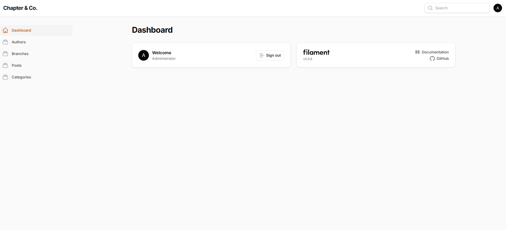
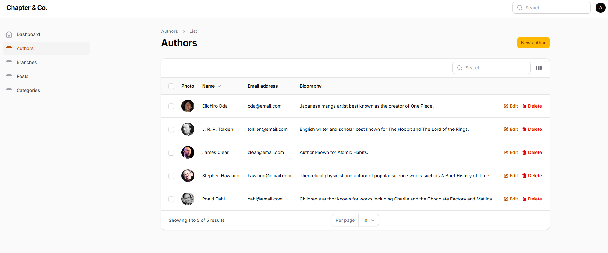
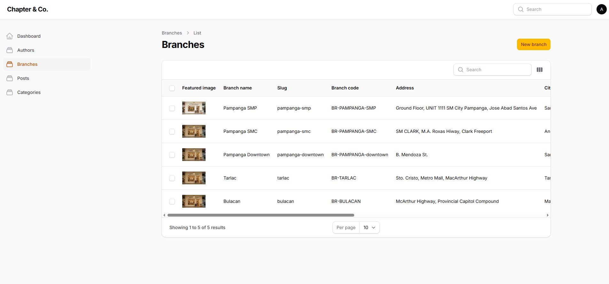
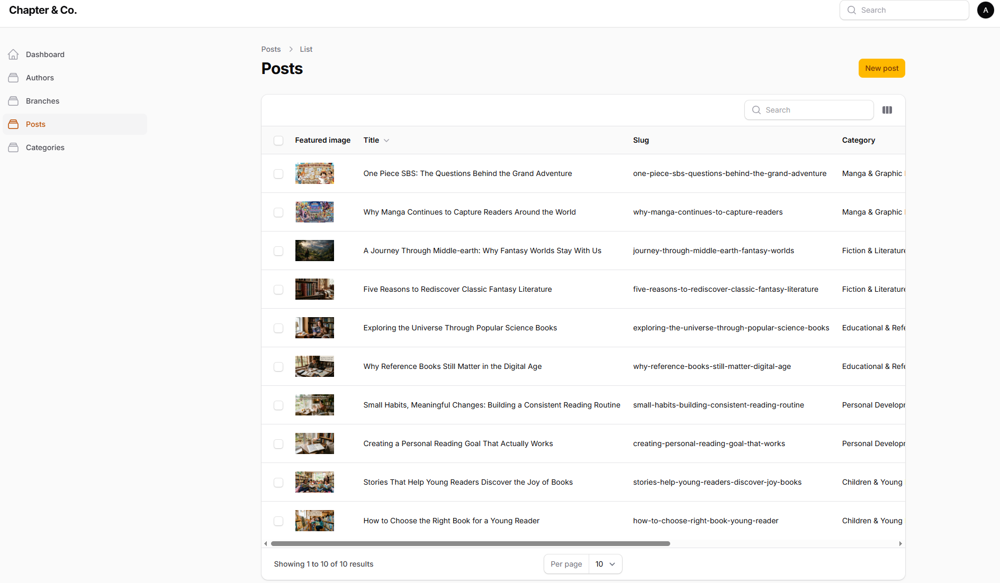
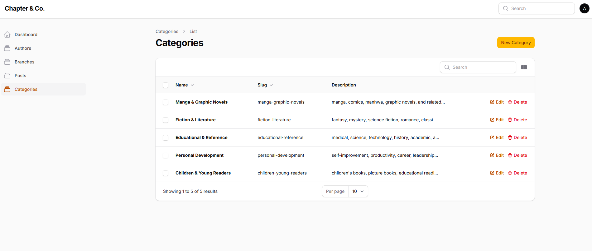
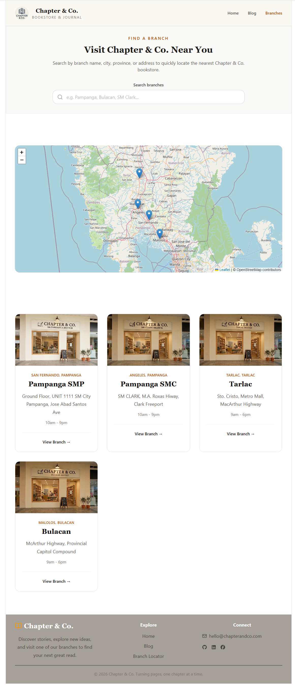

## Overview

Chapter & Co. is a headless CMS bookstore application that separates the backend and frontend into two independent applications.

- The **Laravel + Filament** backend serves as a content management system and REST API.
- The **React + TypeScript** frontend consumes the API to display blog posts, categories, authors, and bookstore branches.

This architecture demonstrates a decoupled full-stack application using modern web development practices.
---

## Screenshots

### Admin Panel (Filament)







### Public Website

### Home


### Blog


### Branch Locator



---

## Features

### Admin (Filament CMS)

- Dashboard
- Category Management
- Author Management
- Blog Post Management
- Branch Management
- Image Uploads
- Published / Draft Posts
- Active / Inactive Branches

### Public Website

- Home Page
- Latest Stories
- Blog Listing
- Blog Details
- Category Details
- Branch Locator
- Interactive OpenStreetMap
- Branch Search
- Branch Details
- Responsive Design
- Custom 404 Page

---

## Tech Stack

### Backend

- Laravel 12
- PHP 8.2+
- Filament CMS
- MySQL
- Eloquent ORM

### Frontend

- React
- TypeScript
- Vite
- Tailwind CSS
- React Router
- Axios
- React Leaflet
- OpenStreetMap

---

## Project Structure

```
chapter-co/
│
├── backend/
│   ├── app/
│   ├── routes/
│   ├── database/
│   └── ...
│
└── frontend/
    ├── src/
    ├── public/
    └── ...
```

---

## Installation

## Requirements

- PHP 8.2+
- Composer
- Node.js 20+
- MySQL

### Clone repository

```bash
git clone https://github.com/iammark989/hcms.git
cd hcms
```

---

# Backend Setup

```bash
cd backend

copy .env.example .env

composer install

php artisan key:generate
```

Update your MySQL database credentials inside the `.env` file before running the migrations.

Run migrations and seeders:

```bash
php artisan migrate:fresh --seed
```

Create storage link:

```bash
php artisan storage:link
```

Run Laravel:

```bash
php artisan serve
```

Backend will run on:

```
http://127.0.0.1:8000
```

---

# Frontend Setup

```bash
cd frontend
copy .env.example .env
npm install
```

Create `.env`

```env
VITE_API_URL=http://127.0.0.1:8000/api
```

Run

```bash
npm run dev
```

Frontend:

```
http://localhost:5173
```

---

# Default Admin Account

```
Email:
admin@example.com

Password:
password
```

---

## Available REST API Endpoints

## Categories

```
GET /api/categories
GET /api/categories/{slug}
```

## Authors

```
GET /api/authors
```

## Posts

```
GET /api/posts
GET /api/posts/{slug}
```

## Branches

```
GET /api/branches
GET /api/branches/{slug}
```

---

# Seeded Data

The project includes sample data:

- 5 Categories
- 5 Authors
- 10 Blog Posts
- 5 Branches
- Administrator Account

Run

```bash
php artisan migrate:fresh --seed
```

to recreate the demo database.
The seeders also copy all required demo images into the Laravel public storage directory.

---

## Known Limitations

- Blog search is not implemented.
- Pagination is not implemented.
- Geocoding is not implemented because branch coordinates are entered manually.

## Maps are implemented using:
- React Leaflet
- OpenStreetMap tiles
Coordinates are stored in the database and retrieved through the Laravel API.

# Future Improvements

- Search blog posts
- Author profile page
- Pagination
- Related posts
- Authentication for customers
- Book catalog
- Online ordering

---

## Developer

**Mark Arvin Valenzuela**

Built as part of a Laravel + React Headless CMS technical examination.

- GitHub: https://github.com/iammark989
